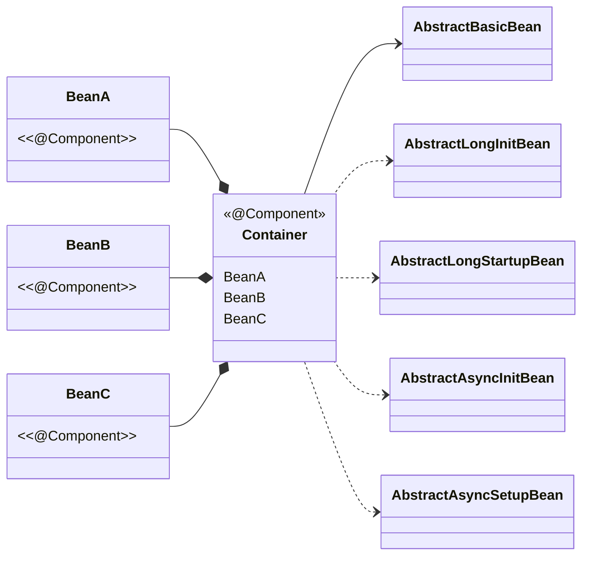

```mermaid
classDiagram
direction RL
    class Container{
    <<@Component>>
        BeanA
        BeanB
        BeanC
    }
    AbstractBasicBean <-- Container
    AbstractLongInitBean <.. Container
    AbstractLongStartupBean <.. Container
    AbstractAsyncInitBean <.. Container
    AbstractAsyncSetupBean <.. Container
    Container *-- BeanA
    Container *-- BeanB
    Container *-- BeanC
    BeanA : <<@Component>>
    BeanB : <<@Component>>
    BeanC : <<@Component>>
```

